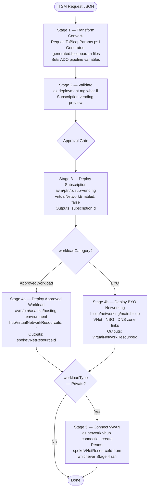
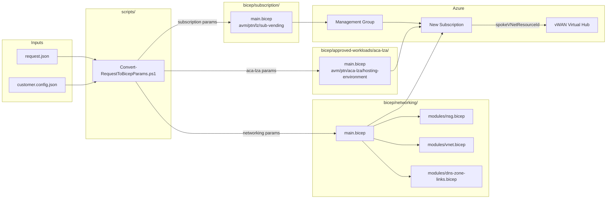

# Architecture Overview

## Pipeline Stage Model

The pipeline has five stages. Stages 4a and 4b are mutually exclusive based on `workloadCategory`.



---

## Component Relationships



---

## Data Flow: Request to Deployment

### 1. Request fields → outcomes

| Field | Value | Effect |
|---|---|---|
| `workloadCategory` | `BYO` | Stage 4b runs; Stage 4a skipped |
| `workloadCategory` | `ApprovedWorkload` | Stage 4a runs; Stage 4b skipped |
| `workloadType` | `Private` | Corp MG · Stage 5 vWAN connect · DNS zone links |
| `workloadType` | `Public` | Online MG · no peering |
| `workloadType` | `Sandbox` | Sandbox MG · isolated |
| `networkSize` | `Small / Medium / Large` | /27 · /26 · /25 (BYO only) |
| `environment` | `Production` | EA `MS-AZR-0017P` · `subscriptionWorkload: Production` |
| `environment` | `NonProduction` | EA `MS-AZR-0148P` · `subscriptionWorkload: DevTest` |
| `approvedWorkload.pattern` | `ContainerApps` | `bicep/approved-workloads/aca-lza/main.bicep` |

### 2. Transform script outputs

The PowerShell transform script always writes `bicep/subscription/main.generated.bicepparam` and conditionally writes the networking or approved-workload param file. It also emits these ADO variables for downstream stages:

| Variable | Example |
|---|---|
| `lzSubscriptionAliasName` | `contoso-prod-ecommerce-api` |
| `lzManagementGroupId` | `mg-contoso-corp` |
| `lzWorkloadCategory` | `BYO` |
| `lzWorkloadType` | `Private` |
| `lzApprovedWorkloadPattern` | `` (empty for BYO) |
| `lzResourceBaseName` | `contoso-prod-ecommerce-api` |

### 3. Naming convention

All resources follow: `<orgShortName>-<env>-<workloadName>`

Example: `contoso-prod-ecommerce-api`

`orgShortName` and default `location` are sourced from `customer.config.json`.

### 4. Tagging

9 tags total — Azure Policy enforced.

| Source | Tags |
|---|---|
| Request (mandatory) | `BusinessUnit` · `CostCentre` · `DataClassification` · `Owner` · `SupportContact` |
| Pipeline (derived) | `DeployedAt` · `DeployedBy` · `Environment` · `WorkloadName` |

---

## vWAN Connectivity Approach

LZA modules (`aca-lza`, `app-service-lza`) accept `hubVirtualNetworkResourceId` — a `Microsoft.Network/virtualNetworks` resource ID. Azure vWAN hubs are `Microsoft.Network/virtualHubs`, a different resource type. Passing a vWAN hub ID into an LZA module would fail ARM validation.

The platform resolves this by setting `hubVirtualNetworkResourceId: ''` in the LZA wrapper and connecting the spoke VNet to the vWAN hub in Stage 5 via:

```bash
az network vhub connection create \
  --name <resourceBaseName>-vhub-conn \
  --vhub-name <parsed from customer.config.json> \
  --resource-group <vwanHubResourceGroupName> \
  --remote-vnet <spokeVNetResourceId from Stage 4>
```

This pattern applies to both BYO Private and ApprovedWorkload Private deployments.
