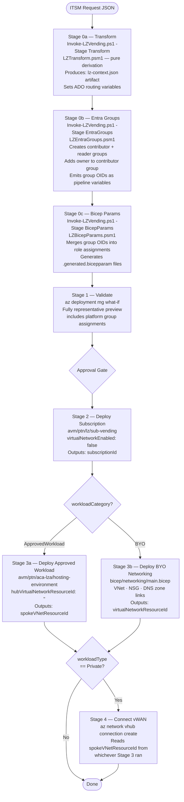
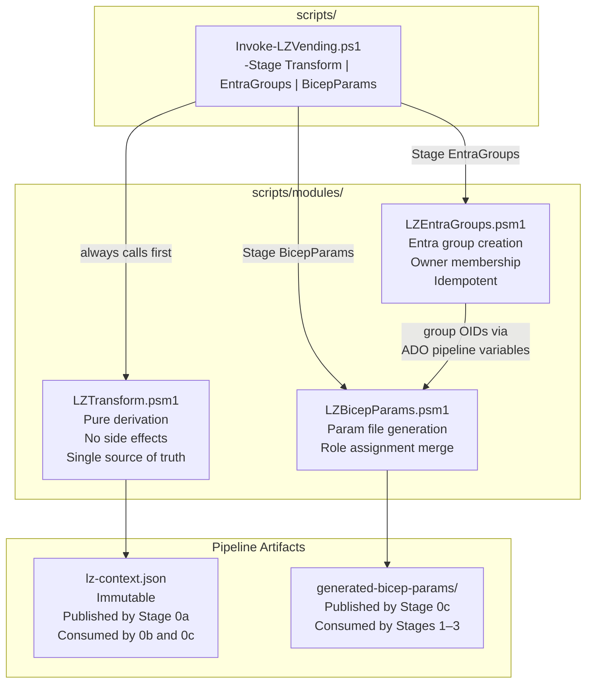
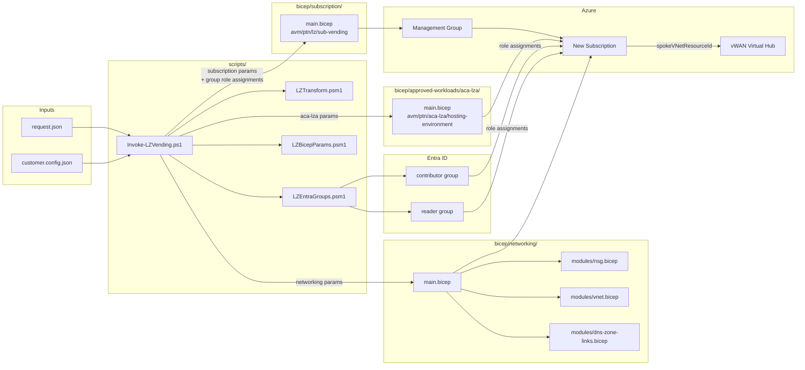

# Architecture Overview

## Pipeline Stage Model

The pipeline has eight stages. Stages 0a, 0b, and 0c run before any validation or deployment. Stages 3a and 3b are mutually exclusive based on `workloadCategory`.



---

## Scripting Module Relationships



---

## Component Relationships



---

## Data Flow: Request to Deployment

### 1. Request fields → outcomes

| Field | Value | Effect |
|---|---|---|
| `workloadCategory` | `BYO` | Stage 3b runs; Stage 3a skipped |
| `workloadCategory` | `ApprovedWorkload` | Stage 3a runs; Stage 3b skipped |
| `workloadType` | `Private` | Corp MG · Stage 4 vWAN connect · DNS zone links |
| `workloadType` | `Public` | Online MG · no peering |
| `workloadType` | `Sandbox` | Sandbox MG · isolated |
| `networkSize` | `Small / Medium / Large` | /27 · /26 · /25 (BYO only) |
| `environment` | `Production` | EA `MS-AZR-0017P` · `subscriptionWorkload: Production` |
| `environment` | `NonProduction` | EA `MS-AZR-0148P` · `subscriptionWorkload: DevTest` |
| `approvedWorkload.pattern` | `ContainerApps` | `bicep/approved-workloads/aca-lza/main.bicep` |
| `tags.Owner` | any email | Resolved to Entra OID · added to contributor group |

### 2. Stage 0a — Transform outputs

`LZTransform.psm1` produces the immutable `lz-context.json` artifact and emits these ADO variables for downstream stage conditions and deployment commands:

| Variable | Example |
|---|---|
| `lzResourceBaseName` | `contoso-prod-ecommerce-api` |
| `lzSubscriptionAliasName` | `contoso-prod-ecommerce-api` |
| `lzManagementGroupId` | `mg-contoso-corp` |
| `lzWorkloadCategory` | `BYO` |
| `lzWorkloadType` | `Private` |
| `lzApprovedWorkloadPattern` | `` (empty for BYO) |
| `lzLocation` | `australiaeast` |

### 3. Stage 0b — Entra Groups outputs

`LZEntraGroups.psm1` emits these ADO variables, consumed by Stage 0c:

| Variable | Example |
|---|---|
| `lzContributorGroupOid` | `aaaaaaaa-aaaa-aaaa-aaaa-aaaaaaaaaaaa` |
| `lzContributorGroupName` | `contoso-prod-ecommerce-api-contributor` |
| `lzReaderGroupOid` | `bbbbbbbb-bbbb-bbbb-bbbb-bbbbbbbbbbbb` |
| `lzReaderGroupName` | `contoso-prod-ecommerce-api-reader` |

### 4. Artifact flow

| Artifact | Produced by | Consumed by |
|---|---|---|
| `lz-context` | Stage 0a | Stages 0b, 0c |
| `generated-bicep-params` | Stage 0c | Stages 1, 2, 3a, 3b |
| `deployment-summary` | Stage 4 | — (download manually) |

### 5. Naming convention

All resources follow: `<orgShortName>-<envPrefix>-<workloadName>`

Example: `contoso-prod-ecommerce-api`

`orgShortName` and default `location` are sourced from `customer.config.json`. The env prefix mapping is `Production → prod`, `NonProduction → nonprod`. This logic lives exclusively in `LZTransform.psm1`.

### 6. Tagging

9 tags total — Azure Policy enforced.

| Source | Tags |
|---|---|
| Request (mandatory) | `BusinessUnit` · `CostCentre` · `DataClassification` · `Owner` · `SupportContact` |
| Pipeline (derived) | `DeployedAt` · `DeployedBy` · `Environment` · `WorkloadName` |

---

## Entra ID RBAC Group Design

Two security groups are provisioned in Stage 0b for every LZ, before any validation or deployment runs.

| Group | Naming | Role | Initial Members |
|---|---|---|---|
| Contributor | `<subscriptionAliasName>-contributor` | Contributor | LZ Owner resolved from `tags.Owner` |
| Reader | `<subscriptionAliasName>-reader` | Reader | Empty |

**Why before validation?** Both group OIDs are merged into the subscription bicepparam by Stage 0c (`LZBicepParams.psm1`), so the what-if output in Stage 1 includes the role assignments. Approvers see the complete deployment picture rather than a partial preview.

**Idempotency:** `LZEntraGroups.psm1` checks for an existing group with the expected display name before creating. Re-running the pipeline on the same request reuses existing groups without error.

**Owner resolution failure:** If `az ad user show` cannot resolve the owner email (guest user, shared mailbox, UPN mismatch), Stage 0b logs a warning and continues. Groups are still created and role-assigned; membership is populated manually. A pipeline failure at this point would block subscription creation for a recoverable membership issue — the warning-and-continue approach is deliberate.

**Graph permissions required:** Entra group creation and user lookup require Microsoft Graph API permissions on the WIF service principal, separate from Azure RBAC:

| Permission | Purpose |
|---|---|
| `Group.Create` | Create new security groups |
| `GroupMember.ReadWrite.All` | Add members to groups |
| `User.Read.All` | Resolve owner email to Object ID |

These are granted in Entra ID (App registrations → API permissions → Microsoft Graph) and require admin consent.

---

## vWAN Connectivity Approach

LZA modules (`aca-lza`, `app-service-lza`) accept `hubVirtualNetworkResourceId` — a `Microsoft.Network/virtualNetworks` resource ID. Azure vWAN hubs are `Microsoft.Network/virtualHubs`, a different resource type. Passing a vWAN hub ID into an LZA module would fail ARM validation.

The platform resolves this by setting `hubVirtualNetworkResourceId: ''` in the LZA wrapper and connecting the spoke VNet to the vWAN hub in Stage 4 via:

```bash
az network vhub connection create \
  --name <resourceBaseName>-vhub-conn \
  --vhub-name <parsed from customer.config.json> \
  --resource-group <vwanHubResourceGroupName> \
  --remote-vnet <spokeVNetResourceId from Stage 3>
```

This pattern applies to both BYO Private and ApprovedWorkload Private deployments.
